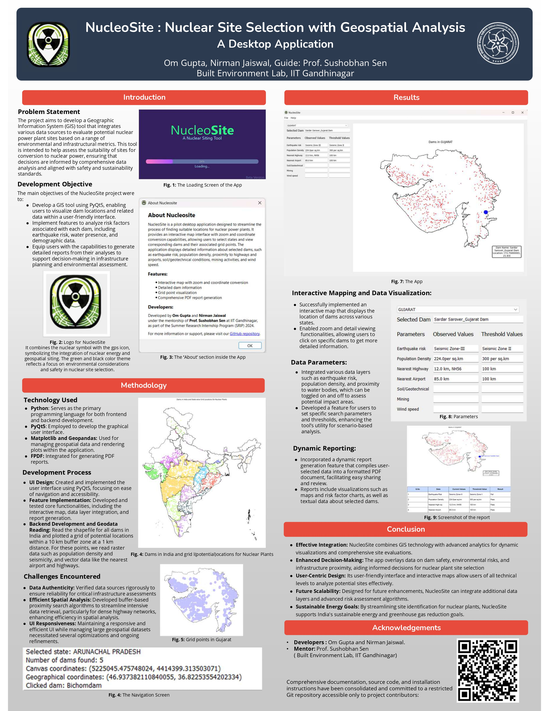

# NucleoSite - Nuclear Site Selection Tool

## Project Overview
NucleoSite is an innovative desktop application developed to assist in selecting optimal sites for nuclear facilities in India. The tool uses Python and PyQt5 to provide interactive geographical visualizations of dam locations, integrating extensive data analysis to assess dam safety and environmental impacts effectively.

*The main interface of NucleoSite shows the interactive map.*

## Key Features
- **Interactive Map Visualization**: Users can explore dam locations across various states with tools to zoom and gather more detailed data interactively.

*Dams in India and potential grid locations for Nuclear Plants*

  
- **Advanced Data Analysis**: Incorporates multiple data layers to assess factors such as seismic risks, population density, and proximity to water bodies.

Grid of potential locations within a 10 km buffer zone at a 1 km distance*

- **Dynamic Reporting**: Enables the generation and exportation of detailed PDF reports summarizing user analysis findings.
- **Customizable Search Parameters**: Users can define specific search criteria and thresholds, tailoring the output to particular needs.

*Example of a report generation module with output preview.*

## Technologies Used
- **Python**: The core programming language used.
- **PyQt5**: Utilized to create the graphical user interface.
- **Matplotlib & GeoPandas**: For processing and visualizing geospatial data.
- **FPDF**: For generating PDF reports.

## Acknowledgements
- Mentorship provided by Prof. Sushobhan Sen, IIT Gandhinagar.
- Developed by Om Gupta and Nirman Jaiswal.

